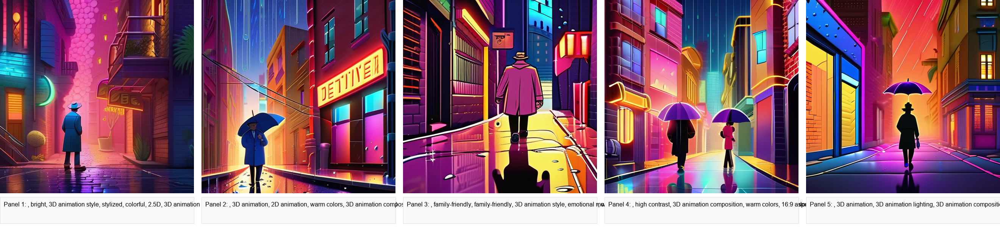
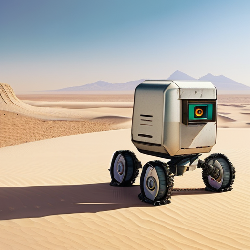
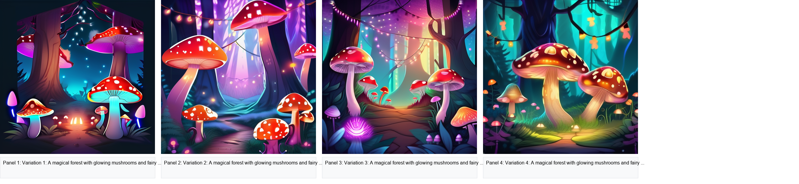
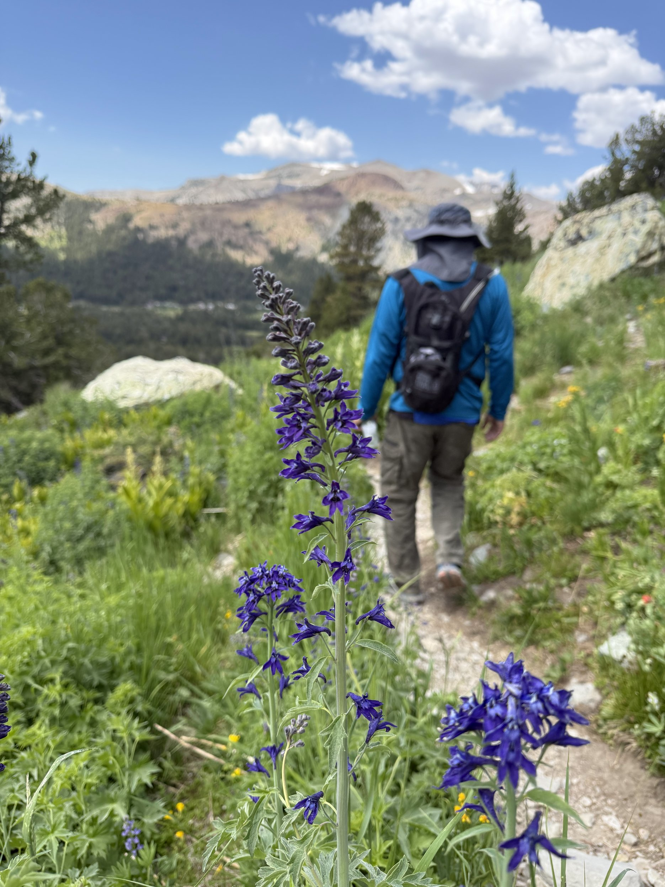
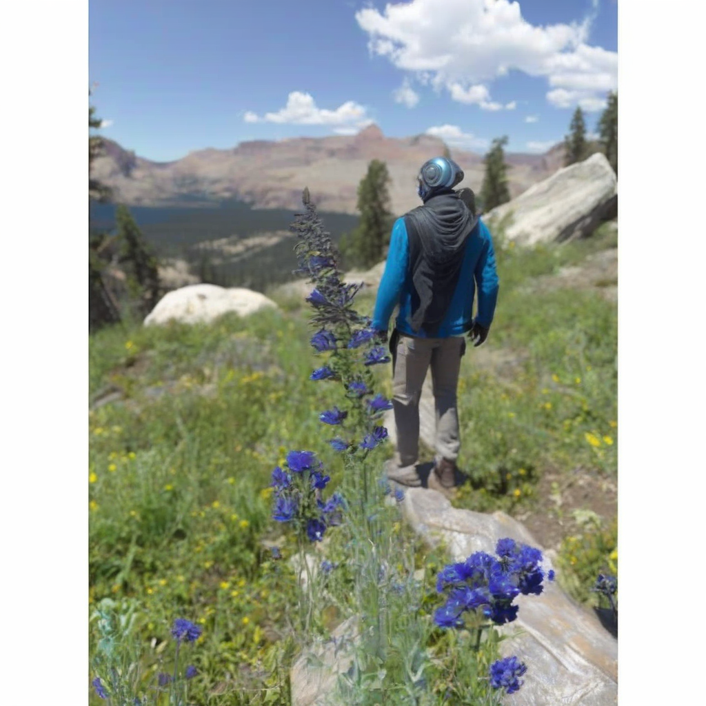
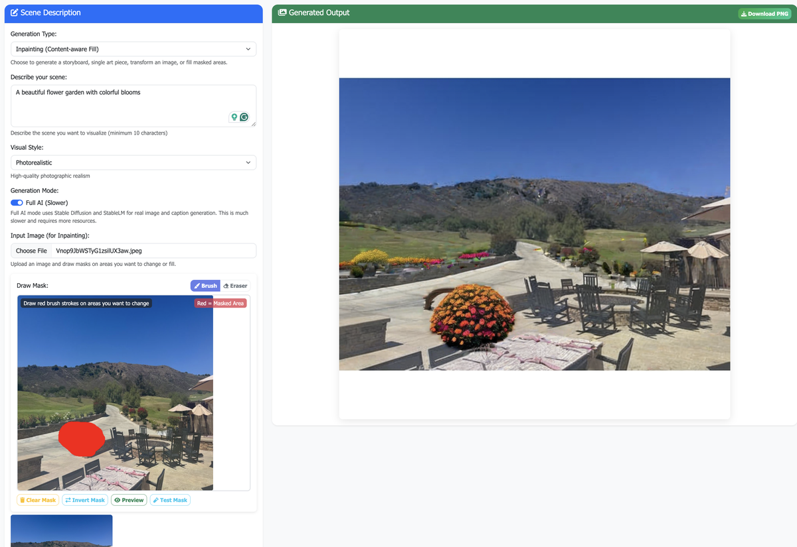
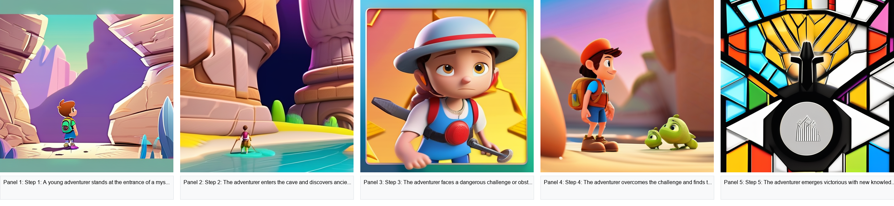
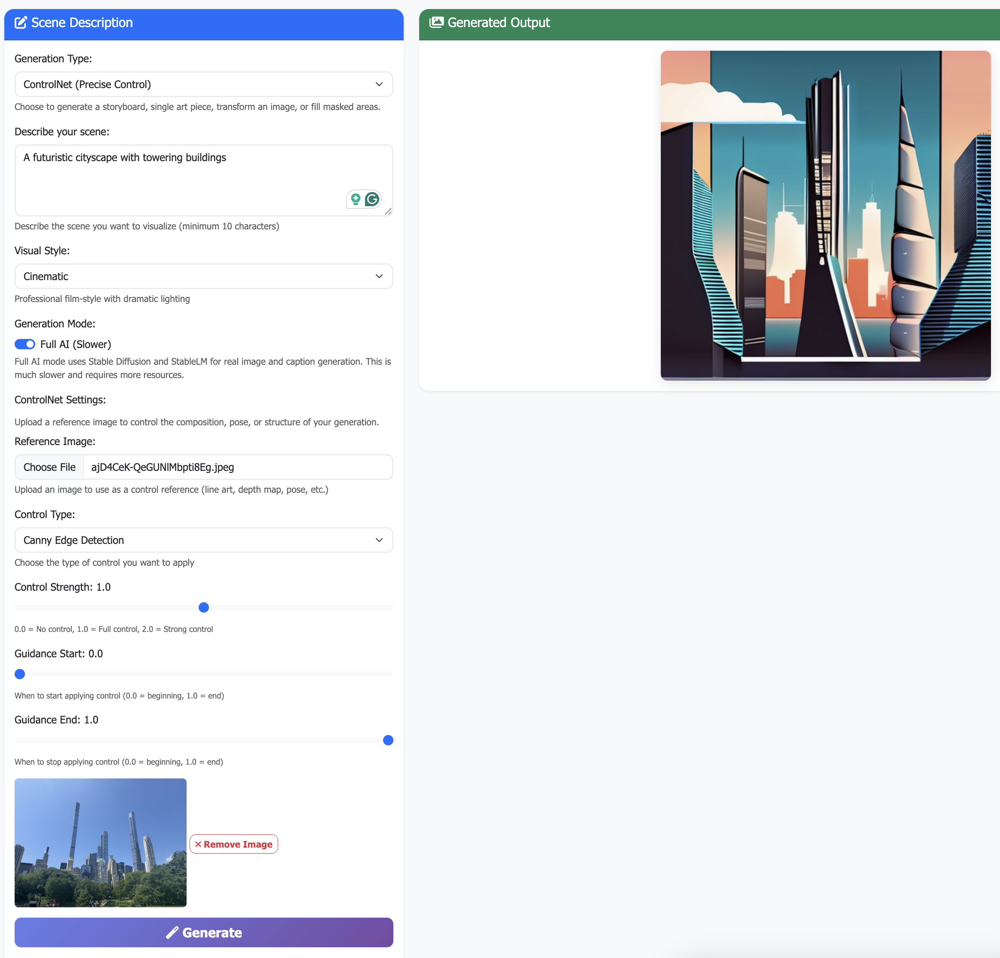

# Diffusion Lab

Create professional AI art and storyboards instantly from text prompts. Python web app powered by Stable Diffusion XL with advanced features like inpainting, ControlNet, and batch generation.

[](https://github.com/arun-gupta/diffusion-lab/blob/main/LICENSE)
[](https://www.python.org/downloads/)

## 🚀 Quick Start

```bash
# Clone and setup
git clone https://github.com/arun-gupta/diffusion-lab.git
cd diffusion-lab
python -m venv venv
source venv/bin/activate  # On Windows: venv\Scripts\activate
pip install -r requirements.txt

# Run the web app
python3 -m diffusionlab.api.webapp
# Open http://localhost:5001 in your browser
```

## ✨ Features

- **📖 Storyboard Generation**: Create 5-panel storyboards with AI images and captions
- **🎨 Single-Image Art**: Generate high-quality AI images from text prompts
- **🔄 Batch Generation**: Create multiple variations of the same prompt for creative exploration
- **🔄 Image-to-Image**: Transform sketches/photos into polished artwork
- **🎯 Inpainting**: Remove objects or fill areas with AI-generated content
- **🔗 Prompt Chaining**: Create evolving story sequences with multiple prompts
- **🎯 ControlNet**: Precise control over composition, pose, and structure using reference images
- **📱 Web Interface**: Modern, responsive UI with real-time generation

## 📸 Example Outputs

### 📖 Storyboard Generation
**"A detective walks into a neon-lit alley at midnight, rain pouring down"** *(Cinematic style)*



### 🎨 Single-Image Art
**"A spaceship crew encounters an alien artifact on a distant planet"** *(Pixar style)*



### 🔄 Batch Generation
**"A magical forest with glowing mushrooms and fairy lights"** *(4 variations, Anime style, 0.8 strength)*



### 🔄 Image-to-Image Transformation
**"A polished character design for a sci-fi video game protagonist"** *(Photorealistic style, strength: 0.5)*

| Input Image *(1870×2493 → 1024×1024)* | Output Image *(AI standard size)* |
|----------------------------------------|-----------------------------------|
|  |  |

### 🎯 Inpainting (Content-aware Fill)
**Object removal: "Natural landscape continuation with trees and sky"** *(Photorealistic style)*



### 🔗 Prompt Chaining (Story Evolution)
**Character Journey: "A young adventurer's quest from village to mountain peak"** *(Pixar style, 5-step evolution)*

**Template Steps:**
1. Character introduction and setting
2. Character faces a challenge or conflict  
3. Character overcomes the challenge
4. Character learns and grows
5. Character reaches their goal or destination



### 🎯 ControlNet (Precise Control)
**"A majestic dragon in a fantasy landscape"** *(Cinematic style, Canny edge control, strength: 1.0)*



## 🎮 Usage

For detailed usage instructions, see the [Usage Guide](USAGE_GUIDE.md).

### Basic Usage
1. Open `http://localhost:5001` in your browser
2. Select your mode: **Storyboard**, **Single-Image Art**, **Batch Generation**, **Image-to-Image**, **Inpainting**, **Prompt Chaining**, or **ControlNet**
3. Toggle between **Demo** (fast) and **AI** (full quality) modes
4. Enter your prompt and choose a style
5. For **Batch Generation**: Configure variation count, layout, and strength
6. For **Image-to-Image**: Upload an image and adjust transformation strength
7. For **Inpainting**: Upload an image, draw masks, and describe what should fill them
8. For **Prompt Chaining**: Add multiple prompts for story evolution
9. For **ControlNet**: Upload a reference image, select control type, and adjust strength/guidance
10. Click "Generate" and download your results

### Key Features

#### 📖 Storyboard Generation
- Generate 5-panel storyboards with AI images and captions
- Choose from multiple visual styles
- Perfect for storytelling and concept development

#### 🎨 Single-Image Art
- Create high-quality AI images from text prompts
- Multiple style presets available
- Ideal for concept art and illustrations

#### 🔄 Batch Generation
- Generate multiple variations of the same prompt
- Configure variation count (2-8) and strength
- Choose from grid, horizontal, or vertical layouts

#### 🔄 Image-to-Image
- Upload sketches, photos, or concepts
- Adjust transformation strength (0.1 = subtle, 1.0 = complete change)
- Transform into any style or concept

#### 🎯 Inpainting
- Draw masks on areas to change
- Describe what should fill masked areas
- Remove objects or add new content seamlessly

#### 🔗 Prompt Chaining
- Create story sequences with multiple prompts
- Use templates like "Character Journey" or "Environmental Progression"
- Generate evolving narratives

#### 🎯 ControlNet
- Upload reference images for precise control over composition
- Choose from Canny edge detection, depth maps, pose estimation, or segmentation
- Adjust control strength and guidance timing for fine-tuned results

## 🛠️ Installation

### Requirements
- Python 3.8+
- CUDA-compatible GPU (recommended) or Apple Silicon (M1/M2/M3)
- 8GB+ RAM (16GB+ recommended for AI mode)

**Tested System Specifications:**
- **Hardware**: Apple M1 Max
- **OS**: macOS Sequoia 15.5
- **Memory**: 64 GB RAM
- **Storage**: SSD with sufficient space for AI models (~10GB)

### Setup
```bash
# Clone repository
git clone https://github.com/arun-gupta/diffusion-lab.git
cd diffusion-lab

# Create virtual environment
python -m venv venv
source venv/bin/activate  # On Windows: venv\Scripts\activate

# Install dependencies
pip install -r requirements.txt

# Run web application
python3 -m diffusionlab.api.webapp
```

### Alternative Interfaces
```bash
# Gradio Interface
python3 -m diffusionlab.tasks.storyboard

# Demo Version (no AI models)
python3 -m diffusionlab.tasks.demo
```

## 📁 Project Structure

```
diffusion-lab/
├── diffusionlab/
│   ├── api/webapp.py          # Flask web application
│   ├── tasks/                 # Generation tasks
│   ├── static/                # CSS, JS, generated images
│   ├── templates/             # HTML templates
│   └── config.py              # Configuration settings
├── docs/                      # Example images and documentation
├── tests/                     # Test scripts
└── requirements.txt           # Python dependencies
```

## 🔧 Troubleshooting

For detailed troubleshooting information, see the [Troubleshooting Guide](TROUBLESHOOTING.md).

### Quick Fixes

**Static files not loading (404 errors)**
```bash
# Run from project root
python3 -m diffusionlab.api.webapp
```

**AI mode not available**
- Check all dependencies are installed
- Ensure running from project root
- Verify `diffusionlab/tasks/` directory exists

**Generate button not working**
- Check browser console for JavaScript errors
- Ensure `app.js` loads without 404 errors

### Getting Help
- Check browser console (F12) for JavaScript errors
- Watch Flask logs in terminal for server errors
- Visit [Issues](https://github.com/arun-gupta/diffusion-lab/issues) for known problems
- See [Troubleshooting Guide](TROUBLESHOOTING.md) for comprehensive solutions

## 🚧 Planned Features

- **✅ Storyboard Generation**: Create 5-panel storyboards with AI images and captions *(Implemented)*
- **✅ Single-Image Art**: Generate high-quality AI images from text prompts *(Implemented)*
- **✅ Batch Generation**: Create multiple variations of the same prompt for creative exploration *(Implemented)*
- **✅ Image-to-Image**: Transform sketches/photos into polished artwork *(Implemented)*
- **✅ Inpainting**: Remove objects or fill areas with AI-generated content *(Implemented)*
- **✅ Prompt Chaining**: Create evolving story sequences with multiple prompts *(Implemented)*
- **✅ ControlNet**: Precise control over composition, pose, and structure using reference images *(Implemented)*
- **🔄 Outpainting**: Extend image borders
- **🔄 Style Transfer**: Apply artistic styles
- **🔄 Animated Diffusion**: Frame interpolation
- **🔄 Custom Training**: DreamBooth integration

## 📄 License

This project is licensed under the Apache License 2.0 - see the [LICENSE](LICENSE) file for details.

---

**💡 Tip**: Start with Demo mode to test features quickly, then switch to AI mode for full-quality generation! 