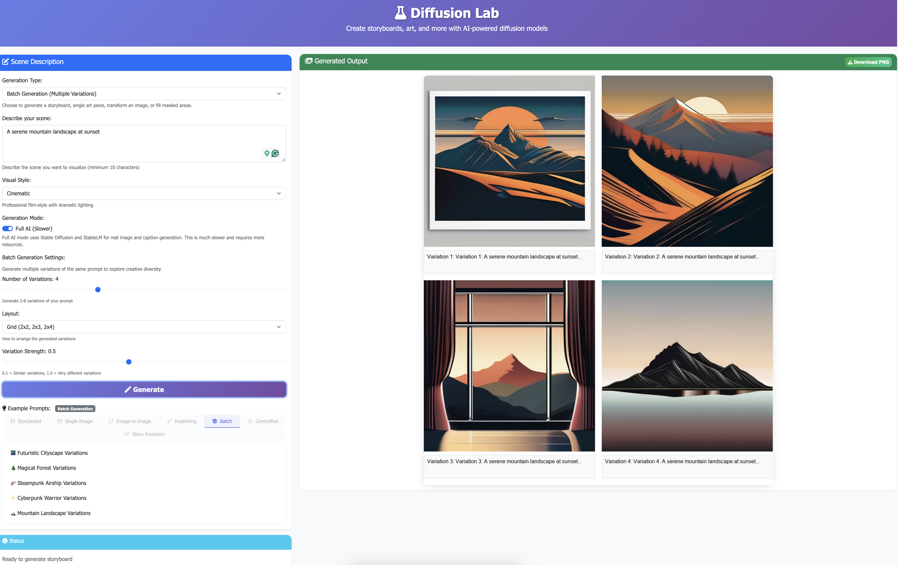

# Diffusion Lab

A Python application and creative toolkit for generating storyboards, single-image art, and more using Stable Diffusion and AI-powered features.

# 
# 

# Table of Contents
- [Main Features](#main-features)
- [Configurable Options](#configurable-options)
- [Quick Start Example](#quick-start-example)
- [Screenshot](#screenshot)
- [How It Works](#how-it-works)
- [Usage](#usage)
- [Installation](#installation)
- [Directory Structure](#directory-structure)
- [Planned Features](#planned-features)
- [Troubleshooting](#troubleshooting)
- [License](#license)

## Main Features

- **Storyboard Mode:** Generate a 5-panel storyboard from a scene description, with AI-generated images and captions.
- **Single-Image Art Mode:** Generate a single, high-quality AI image from a prompt in your chosen style.
- **Image-to-Image (img2img):** Transform sketches, photos, or rough concepts into polished art by uploading an input image and applying AI transformation.
- **Export:** Save storyboards as PDF or images.

## Configurable Options

- **Style Options:** Choose from different visual styles (cinematic, anime, noir, etc.).
- **Demo/AI Mode Toggle:** Choose between fast demo mode (placeholder images) and full AI mode (real Stable Diffusion/StableLM generation) using the toggle above the generation type selector.

## Installation

1. **Clone the repository**:
   ```bash
   git clone https://github.com/arun-gupta/diffusion-lab.git
   cd diffusion-lab
   ```

2. **Create a virtual environment**:
   ```bash
   python -m venv venv
   source venv/bin/activate  # On Windows: venv\Scripts\activate
   ```

3. **Install dependencies**:
   ```bash
   pip install -r requirements.txt
   ```

4. **Run the application**:

   **Option A: Web Application (Recommended)**
   ```bash
   python3 -m diffusionlab.api.webapp
   # Then open http://localhost:5001 in your browser
   ```

   **Option B: Gradio Interface**
   ```bash
   python3 -m diffusionlab.tasks.storyboard
   # Then open http://localhost:7860 in your browser
   ```

   **Option C: Demo Version**
   ```bash
   python3 -m diffusionlab.tasks.demo
   ```

## Quick Start Example

```bash
# 1. Start the web application from the project root
python3 -m diffusionlab.api.webapp

# 2. Open your browser and go to:
http://localhost:5001

# 3. Enter a prompt, e.g.:
#   "A robot wanders a post-apocalyptic desert searching for signs of life"
# 4. Select your desired mode and style, then click Generate.
```

## Screenshot



## Example Outputs

Here are some sample results generated by Diffusion Lab:

**Storyboard Example:**

**Prompt:**
A detective walks into a neon-lit alley at midnight, rain pouring down

**Style:**
Cinematic


**Single-Image Art Example:**

**Prompt:**
A spaceship crew encounters an alien artifact on a distant planet

**Style:**
Pixar


**Image-to-Image Example:**

**Input Image:**
A rough pencil sketch of a character

**Prompt:**
A detailed oil painting of a majestic warrior in fantasy armor

**Style:**
Cinematic

**Strength:**
0.75


<!--
To add your own examples, place images in the docs/ directory and update the paths above.
Examples include: main-ui.png, sample-storyboard.png, sample-art.png, sample-img2img.png
-->

## How It Works

1. **User Input:**
   - The user enters a scene description or art prompt in the web UI and selects the desired mode (Storyboard, Single-Image Art, or Image-to-Image), style, and Demo/AI mode.
   - For Image-to-Image mode, the user uploads an input image and adjusts the transformation strength.
2. **Request Sent to Backend:**
   - The frontend sends the input to the Flask backend via an AJAX request.
   - For img2img, the input image is uploaded separately and processed.
3. **AI Model Processing:**
   - In Demo mode, the backend generates placeholder images and captions.
   - In AI mode, the backend uses Stable Diffusion XL (for images) and StableLM (for captions) to generate real, high-quality outputs based on the prompt and style.
   - For img2img, the AI model transforms the uploaded image according to the prompt and strength setting.
4. **Output Generation:**
   - The backend assembles the images (and captions, if storyboard) into a single output image (storyboard or single art piece).
5. **Result Displayed:**
   - The generated image is sent back to the frontend and displayed in the UI, where the user can view or download it.

<!-- Optional: Simple diagram (text-based) -->
```
User Input → [Frontend] → /generate → [Flask Backend]
    └─> [Demo Mode] → Placeholder Images
    └─> [AI Mode] → Stable Diffusion XL + StableLM
        └─> Output Image(s) → [Frontend Display]
```

## Usage

### Web Application (Recommended)
1. Open your browser and go to `http://localhost:5001`
2. Select either **Storyboard** or **Single-Image Art** mode
3. Use the Demo/AI toggle to choose between fast demo mode and full AI mode
4. Enter your scene description or art prompt in the text box
5. Choose your preferred style from the dropdown
6. **For Image-to-Image mode:**
   - Upload an input image (sketch, photo, or concept)
   - Adjust the transformation strength slider (0.1 = keep original, 1.0 = complete transformation)
7. Click "Generate"
8. Download the PNG file or view the results

**Note:** Generated images are saved locally in the `static/storyboards/` directory.

## Image-to-Image (img2img) Usage Guide

### Getting Started with Image-to-Image

The Image-to-Image feature allows you to transform existing images using AI. This is perfect for:
- Converting sketches into finished artwork
- Enhancing or stylizing photographs
- Developing concept art from rough ideas
- Changing image styles while preserving content

> **💡 See the example above**: Check out the "Image-to-Image Example" in the Example Outputs section to see a before/after transformation of a sketch into a detailed oil painting.

### Step-by-Step Process

1. **Select Image-to-Image Mode**
   - Choose "Image-to-Image" from the Generation Type dropdown
   - The image upload section will automatically appear

2. **Upload Your Input Image**
   - Click "Choose File" and select your image
   - Supported formats: JPEG, PNG, GIF, BMP, WebP
   - Maximum file size: 10MB
   - The image will be automatically resized to 512x512 pixels

3. **Adjust Transformation Strength**
   - Use the slider to control how much the AI should transform your image
   - **0.1-0.3**: Subtle changes, preserves most of the original
   - **0.4-0.6**: Moderate transformation, good balance
   - **0.7-0.9**: Significant changes, more creative interpretation
   - **1.0**: Complete transformation, maximum creativity

4. **Write Your Transformation Prompt**
   - Describe what you want the AI to do with your image
   - Be specific about style, mood, and desired changes
   - Example: "Transform this into a cyberpunk cityscape with neon lights"

5. **Choose Your Style**
   - Select from available styles (Cinematic, Anime, Photorealistic, etc.)
   - The style will influence the final appearance

6. **Generate and Download**
   - Click "Generate" to start the transformation
   - Wait for processing (faster in Demo mode, slower in AI mode)
   - Download your transformed image when complete

### Tips for Best Results

- **Start with Clear Images**: Higher quality input images produce better results
- **Use Descriptive Prompts**: Be specific about what you want to change
- **Experiment with Strength**: Try different strength values for the same image
- **Combine with Styles**: Use style presets to enhance your transformations
- **Iterate**: Generate multiple versions and refine your prompts

### Common Use Cases

- **Artists**: Convert rough sketches into finished illustrations
- **Photographers**: Enhance or stylize existing photos
- **Designers**: Develop concepts from basic drawings
- **Content Creators**: Create variations of existing images
- **Students**: Practice art techniques and styles

### Quick Reference

| Input Type | Recommended Strength | Example Prompt |
|------------|---------------------|----------------|
| Pencil Sketch | 0.7-0.9 | "A detailed oil painting with vibrant colors" |
| Blurry Photo | 0.4-0.6 | "A sharp, high-resolution photograph" |
| Portrait | 0.5-0.8 | "A renaissance-style oil painting" |
| Landscape | 0.6-0.9 | "A cyberpunk cityscape with neon lights" |
| Character Design | 0.7-1.0 | "A professional character concept for a video game" |

### Gradio Interface
1. Open your browser and go to `http://localhost:7860`
2. Enter your scene description in the text box
3. Choose your preferred style from the dropdown
4. Click "Generate Storyboard"
5. Wait for the AI to generate your 5-panel storyboard
6. Download or view the results

## Example Inputs

### Storyboard & Single-Image Art Prompts
- "A detective walks into a neon-lit alley at midnight, rain pouring down"
- "A robot wanders a post-apocalyptic desert searching for signs of life"
- "A young wizard discovers an ancient library hidden in the mountains"

### Image-to-Image Transformation Examples
- **Sketch to Art**: Upload a pencil sketch + "A detailed oil painting of a majestic dragon in a fantasy landscape"
- **Photo Enhancement**: Upload a blurry photo + "A sharp, professional photograph with enhanced details and vibrant colors"
- **Style Transfer**: Upload a portrait photo + "A renaissance-style oil painting with dramatic lighting and rich textures"
- **Concept Development**: Upload a rough doodle + "A polished character design for a sci-fi video game protagonist"
- **Background Change**: Upload a person photo + "The same person standing in a cyberpunk cityscape at night"

## Technical Details

### Web Application
- **Backend**: Flask web framework with RESTful API
- **Frontend**: Modern HTML5/CSS3/JavaScript with Bootstrap 5
- **Image Processing**: PIL/Pillow for image generation and manipulation
- **Real-time Updates**: AJAX-powered interface with progress tracking

### Gradio Interface
- **Image Generation**: Uses Stable Diffusion XL for high-quality image generation
- **Caption Generation**: Uses StableLM for contextual descriptions
- **UI Framework**: Gradio for a clean, web-based interface
- **Export**: PDF generation with reportlab

## Requirements

- Python 3.8+
- CUDA-compatible GPU (recommended for faster generation)
- 8GB+ RAM
- Internet connection for model downloads

## Planned Features

- **✅ 1. Image-to-Image (img2img):** Transform sketches, photos, or rough concepts into polished art. *(Implemented)*
- **2. Inpainting (Content-aware Fill):** Remove or replace parts of an image by masking them and describing what should go there.
- **3. Outpainting (Image Expansion):** Extend the borders of an image with new, contextually appropriate content.
- **4. Style Transfer:** Apply the style of one image (e.g., a famous painting) to another image.
- **5. Prompt Chaining / Story Evolution:** Generate a sequence of images that evolve based on a series of prompts.
- **6. Batch Generation & Variations:** Generate multiple variations for a single prompt to explore creative diversity.
- **7. Animated Diffusion (Frame Interpolation):** Create short animations by generating frames that morph between prompts or images.
- **8. DreamBooth / Custom Subject Training:** Fine-tune Stable Diffusion on a small set of images of a person, pet, or object, so you can generate that subject in any context.
- **9. Text-Guided Image Editing:** Edit an existing image by describing the change in text.
- **10. Super-Resolution / Image Enhancement:** Upscale low-resolution images or enhance details using diffusion-based super-resolution models.
- **11. AI Avatars and Profile Pictures:** Generate unique avatars or profile pictures in various styles from a photo or prompt.
- **12. AI Art Gallery / Curation:** Curate and display the best generations, or let users vote on their favorites.
- **13. API Playground:** Let users experiment with all Stable Diffusion parameters (guidance scale, steps, seed, etc.).
- **14. Prompt Engineering Tools:** Help users craft better prompts with suggestions, negative prompts, and prompt templates.
- **15. Model Comparison:** Let users compare outputs from different Stable Diffusion checkpoints or custom models.

## Directory Structure

```
diffusion-lab/
├── diffusionlab/
│   ├── __init__.py
│   ├── config.py
│   ├── utils.py
│   ├── setup.py
│   ├── requirements.txt
│   ├── static/
│   ├── templates/
│   ├── api/
│   │   ├── __init__.py
│   │   └── webapp.py
│   └── tasks/
│       ├── __init__.py
│       ├── storyboard.py
│       └── demo.py
├── tests/
│   └── test_installation.py
├── README.md
├── LICENSE
├── QUICKSTART.md
├── WEBAPP_README.md
├── run_webapp.sh
├── run.sh
├── run.bat
├── requirements.txt
├── setup.py
```

- **diffusionlab/**: Main package code, feature modules, static assets, templates, and API logic
- **tests/**: Test scripts
- **README.md, LICENSE, QUICKSTART.md, etc.**: Top-level documentation and legal files
- **run_*.sh, run.bat**: Entrypoint scripts 

## Troubleshooting

### Static Files Not Loading (JS/CSS 404)
- **Symptom:** The UI is broken, or clicking Generate does nothing. Browser console shows 404 for /static/js/app.js or /static/css/style.css.
- **Solution:**
  - Make sure you run the app from the project root with:
    ```bash
    python3 -m diffusionlab.api.webapp
    ```
  - Ensure Flask is configured with the correct static and template folder paths and `static_url_path='/static'`.

### AI Mode Not Available / ImportError
- **Symptom:** Error message: "AI mode is not available. Please ensure diffusionlab/tasks/storyboard.py and dependencies are present."
- **Solution:**
  - Make sure all imports in your code use absolute package paths (e.g., `from diffusionlab.config import *`).
  - Run the app from the project root.
  - Check for typos or missing files in the `diffusionlab/tasks/` directory.

### Accessibility Warning: aria-hidden and Focus
- **Symptom:** Browser console warning: "Blocked aria-hidden on an element because its descendant retained focus..."
- **Solution:**
  - This is a warning, not an error. The app will still work.
  - The app moves focus to the Generate button when the modal closes to improve accessibility.

### No /generate Request When Clicking Generate
- **Symptom:** Nothing happens when clicking Generate, and no request appears in Flask logs.
- **Solution:**
  - Check that `app.js` is loaded (no 404 in Network tab).
  - Check for JavaScript errors in the browser console.
  - Ensure the form and button IDs in the HTML match those in the JS.

### General Tips
- Always run the app from the project root.
- If you make structural changes, restart the Flask server.
- For more help, check the browser console, Flask logs, and the [Issues](https://github.com/arun-gupta/diffusion-lab/issues) page.

### Image-to-Image Specific Issues

**Upload Fails**
- **Symptom**: "Invalid file type" error when uploading images
- **Solution**: Ensure your image is in a supported format (JPEG, PNG, GIF, BMP, WebP)

**File Too Large**
- **Symptom**: "Image file too large" error
- **Solution**: Resize your image to under 10MB before uploading

**No Transformation Effect**
- **Symptom**: Output looks identical to input
- **Solution**: Increase the strength slider value (try 0.7-1.0)

**Too Much Transformation**
- **Symptom**: Output is completely different from input
- **Solution**: Decrease the strength slider value (try 0.1-0.3)

**Poor Quality Results**
- **Symptom**: Transformed image looks blurry or distorted
- **Solution**: 
  - Use higher quality input images
  - Try different strength values
  - Experiment with different style presets
  - Use more descriptive prompts

### How to Check Flask Logs
- When running the app, watch the terminal for error messages or tracebacks after you perform an action in the UI (like clicking Generate).
- 500 errors or ImportErrors will be shown here and can help pinpoint the problem.

### How to Use Browser Developer Tools
- **Open Developer Tools:** Press F12 or right-click and select "Inspect" in your browser.
- **Console Tab:** Shows JavaScript errors, warnings, and logs. Red errors here often indicate why the UI is not working.
- **Network Tab:** Shows all network requests. Look for 404s (missing files) or 500s (server errors) when you click Generate or load the page.
- **Tip:** If you see a request to `/generate` with a 500 error, check the Flask logs for the cause. 

## License

This project is licensed under the Apache License 2.0 - see the LICENSE file for details. 